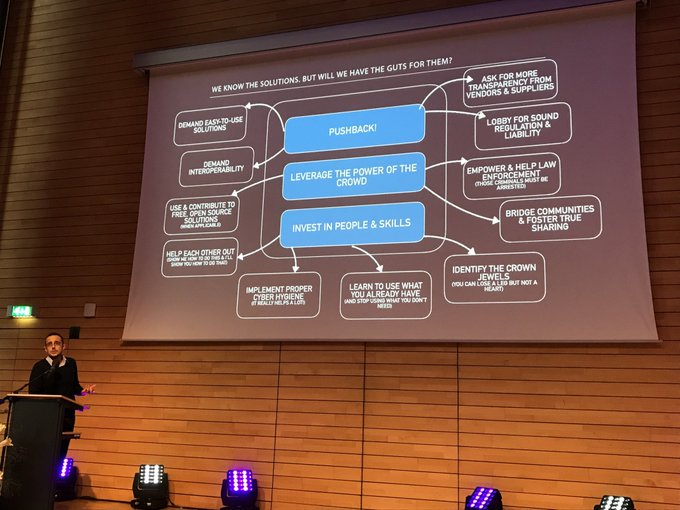

# CM1 - Introduction

_François Lesueur ([francois.lesueur@insa-lyon.fr](mailto:francois.lesueur@insa-lyon.fr), [@FLesueur](https://twitter.com/FLesueur))_

<!-- structure, plus carrée, plus détaillée + exemples. Des sections claires, des objectifs, un fil rouge
Qu'est-ce que la sécu ? CIA. Qu'est-ce que "faire de la sécu" ? Opérer une infra (?). Qu'est-ce qu'un outil de sécu ? truc à tout faire bof vs outil d'aide à l'opérateur. Et le soft dans tout ça ? -->

<!-- switcher l'ordre, commencer par TP1 avant (un bout) du cours, puis étudier le CM à partir des constations de TP1 -->

Déroulement
===========

<audio controls src="media/introsrs.mp3">

Lire et comprendre le README qui détaille le déroulé de la matière (mais normalement, si vous êtes là, vous l'avez déjà fait...)

Quelques actualités de la sécurité
==============

<audio controls src="media/attaques2020.mp3">

Passer 30 minutes/1 heure pour faire un petit tour d'actualités de votre choix (vous verrez, il y a bien des russes, des chinois et des états-uniens comme promis !)

2020
----

* Raccoon [détails](https://raccoon-attack.com/)
* Carlson Wagonlit victime d'un ransomware
* Garmin victime d'un ransomware
* CVE-2020-5902 et CVE-2020-5903
* DDoS sur les résolveurs DNS [détails](https://www.afnic.fr/fr/ressources/blog/a-propos-de-l-attaque-sur-les-resolveurs-dns-de-fai-francais-1.html)
* Huawei et la 5G (question non limitée à Huawei, évidemment)
* Octopus Scanner [détails](https://securitylab.github.com/research/octopus-scanner-malware-open-source-supply-chain)
* Wordpress File Manager [détails](https://www.zdnet.com/article/millions-of-wordpress-sites-are-being-probed-attacked-with-recent-plugin-bug/)
* Cyberguerre US-Chine [détails](https://us-cert.cisa.gov/ncas/alerts/aa20-258a)
* Zerologon CVE-2020-1472

2019
--------

* Retadup, un botnet demantelé par la gendarmerie (et désactivé à distance) [details](https://www.zdnet.fr/actualites/retadup-le-coup-de-main-d-avast-pour-demanteler-le-botnet-39889659.htm)
* Jailbreak IPhone très bas niveau chekm8 [details](https://blog.trailofbits.com/2019/09/27/tethered-jailbreaks-are-back/)
* Attaque ciblée des smartphones de communautés (Uighurs, Tibet)  [details](https://www.technologyreview.com/f/614277/apple-says-chinas-uighur-muslims-were-targeted-in-iphone-hacking-campaign/), [details](https://citizenlab.ca/2019/09/poison-carp-tibetan-groups-targeted-with-1-click-mobile-exploits/)
* Intrusion avec persistence chez Citrix (supply-chain attack ?) [details](https://www.zdnet.com/article/hackers-lurked-in-citrix-systems-for-six-months/?ftag=CAD2e14604)
* Des ransomwares sur des institutions publiques [details](https://www.wired.com/story/ransomware-hits-georgia-courts-municipal-attacks-spread/)
* Asus Live Update (supply-chain) [details](https://www.wired.com/story/asus-software-update-hack/)
* RCE sur RDP [details](https://wazehell.io/2019/05/22/cve-2019-0708-technical-analysis-rdp-rce/)
* Affaire Huawei/Kaspersky [details](https://www.schneier.com/blog/archives/2019/09/supply-chain_se_1.html)
* Et bien sûr, des tensions géopolitiques
* Non-facts : IA, blockchain

2018
----

* Facebook, 50mio de comptes compromis, utilisé en login tiers. Surveillance home-made, logs [details](https://newsroom.fb.com/news/2018/09/security-update/#details)
* Intel management engine password bypass, AMT, null digest password (pas null pass, null digest), accès caché de l'OS ! [details](https://www.tenable.com/plugins/nessus/97999)
* Meltdown/Spectre, accès caché de l'OS [details](https://www.ovh.com/fr/blog/failles-de-securite-spectre-meltdown-explication-3-failles-mesures-correctives-public-averti/)
* Cryptominer JS, coinhive, TC ;-) (_sécu = ? Utilisation de ressources non prévues/souhaitées, zone grise_) [details](https://blog.malwarebytes.com/cybercrime/2018/02/state-malicious-cryptomining/)
* Nations-Unies, google dorking, (mdp accessibles sur github/trello puis accès aux ressources) [details](https://theintercept.com/2018/09/24/united-nations-trello-jira-google-docs-passwords/)
* DDoS toujours : concurrence minecraft, racket e-commerce [details](https://www.ovh.com/fr/blog/rapport-attaques-ddos-observees-par-ovh-en-2017/)
* VPNFilter, Mirai++ [details](https://blog.talosintelligence.com/2018/05/VPNFilter.html)

2017
-----

* Hack (?) Ethereum
* WannaCry ( motivations mystérieuses, répétition ? Arrêt Renault, St Gobain, Merck)
* NotPetya ( Ukraine, Maersk, Tchernobyl. Répétition ? Supply chain attack bien ancrée. Sacrifié ? étonnant, autre accès encore ?)
* Mirai
* Equifax (143 mio noms/prénoms/SSN/num carte/date naissance pour phishing/usurpation/récup authentif)
* Pacemaker
* DNC/Macron Leaks
* Machines à voter
* MalwareTech (killswitch wannacry, arrêté aux US, passé clairement gris mais le cas d'un peu tous...)
* Deloitte (données privées, logiciel pas à jour)
* CCleaner (supply chain)

Quelques réflexions plus ou moins personnelles
===============

Contexte général : <audio controls src="media/introsecu2.mp3">

Menaces et risque : <audio controls src="media/risques.mp3">

* Outillage/vulns de très simple (script kiddie) à élitiste (nation-sponsored, 0days)
* Attribution difficile et peu vérifiable pour le monde civil (mélange de magie noire, bluff, BS et [lancer de dés](https://i.etsystatic.com/11450141/r/il/0ab70a/1132361728/il_570xN.1132361728_4jgx.jpg)), les étatiques ne communiquent pas dessus.
* Bataille entre grandes puissances, impacts sur tous
* Au fond, qu'est-ce que c'est que de "faire de la sécurité numérique" ?

Enjeux et acteurs
===============

Les acteurs : <audio controls src="media/acteurs.mp3">
Exemple d'enjeu : <audio controls src="media/enjeux.mp3">

* Les organisations (se protéger)
* Les états (protéger leurs orgas, attaquer les autres, mais tous partagent le même soft/hardware. Ils sont très bons, cyberguerre)
* Les hackers (s'amuser, se challenger). Attaque nécessaire pour comprendre, créer cette compétence avec éthique. Audit, bug bounties, on apprend comme ça. Les méchants ne nous ont pas attendus, la sécu a augmenté depuis qu'elle est étudiée/challengée. Pas encore compris dans les nouveaux domaines (FUD pacemaker, attaque judiciaire puis finalement patch)
* L'environnement : des attaquants qui s'adaptent et mènent la danse

[Quelque bons conseils](https://twitter.com/search?q=%23CyberSecMonth%20%40xme)

_Saad Kadhi, head of CERT-EU_
<!-- https://twitter.com/_pst/status/1184461709496467458 -->

 Ce(tte) œuvre est mise à disposition selon les termes de la <a rel="license" href="https://creativecommons.org/licenses/by-nc-sa/2.0/fr/">Licence Creative Commons Attribution - Pas d’Utilisation Commerciale - Partage dans les Mêmes Conditions 2.0 France</a>.
