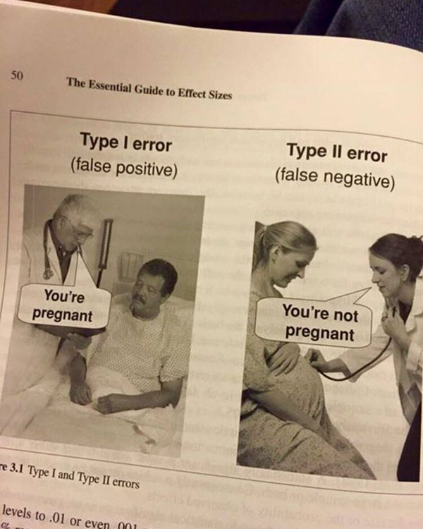

# CM3 - Filtrage et surveillance réseau

_François Lesueur ([francois.lesueur@insa-lyon.fr](mailto:francois.lesueur@insa-lyon.fr), [@FLesueur](https://twitter.com/FLesueur))_

ATTENTION, NON FINALISÉ !
=========================

Buts
====

<audio controls src="media/filtrageintro.mp3"></audio>

* Filtrer : Protéger le SI
	* Diminuer la surface d'attaque
	* Limiter les attaques sur les services ouverts
	* Sur les 2 dimensions extérieur->intérieur (intrusion) et intérieur->intérieur (pivot)
* Surveiller : Détecter pour analyse ou réaction
	* Découvrir les ressources qui ont été impactées
	* Problème de confidentialité ou d'intégrité ?
	* Protéger une prochaine fois, analyser le chemin
	* Ex Yahoo, 3 milliards de comptes, détecté 3 ans plus tard ; Facebook 2018 ; [discours G. Poupard DG ANSSI aux Assises 2019](https://twitter.com/lsamain/status/1181872739495370753)

La terminologie des classes d'outils est floue et les limites entre les cases sont poreuses ! Évidemment, ce flou et la grande variété de mécanisme et d'actions entretiennent un marché des _appliances_ pas toujours sain, régulièrement conçus à base de [poudre verte](https://poudreverte.org/). L'objectif de ce cours est de découvrir les mécanismes fondamentaux pour pouvoir appréhender l'analyse critique des outils disponibles.

Une solution simple malheureusement trop peu appliquée par les attaquants : [l'evil Bit](https://en.wikipedia.org/wiki/Evil_bit).

Axes d'étude
======

Inspecter des paquets selon les axes d'étude : <audio controls src="media/axes.mp3"></audio>

* Filtre/Alerte
* Niveau OSI
* Contexte pré/post/pas
* Ingress/Egress
* Politique locale/globale/mixte
* Périmétrique ou "discret"/Diffus

| Classe | Niveau | Contexte | Filtrant | In/Out | Local/Global | Périmétrique |
|--------|--------|----------|----------|--------|--------------|--------------|
| Firewall | *4* | Pré | Oui | In+Out | Local | Oui |
| IDS | *7* | Oui | *Non* | In | *Global* | Non |
| IPS | *7* | Oui | *Réaction* | In | *Global* | Non |
| RProxy | *7* | Oui | *Oui* | In+Out | Global | *Non |
| DPI | *7* | Pré | *Oui* | In+Out | *Local* | Oui |
| DCI | *7* | *Oui* | Oui | *In+Out* | Local+Global | Oui |

Firewall
======

<audio controls src="media/firewall.mp3"></audio>

* Segmentation, délimitation de zones (WAN/LAN/DMZ, WAN/DMZ/LAN1/LAN2/LAN3/ADMIN/...)
* Règles locales
* Ouverture d'une liste de services contrôlés, diminution de la surface d'attaque, matrice de flux
* Layer 4
* 1 service = 1 port
* Ex [iptables](https://fr.wikipedia.org/wiki/Iptables)/[nftables](https://fr.wikipedia.org/wiki/Nftables)
* TP2 !

Modèles :

* Historique : WAN/LAN/DMZ, DMZ tampon, LAN à plat (à proscrire)
* Moderne : Segmentation plus fine du LAN, éviter propagation (vers, pivot, ransomware aujourd'hui)

IDS (Intrusion Detection System)
================================

<audio controls src="media/ids.mp3"></audio>

* Alertes, détecter pour réagir !
* Layer 7, dissecteurs de haut niveau
* Regexps, performances relâchées car offline
* Sondes internes, remontée, corrélation (diminuer le bruit, améliorer la pertinence)
* Apparition du concept de faux positifs et faux négatifs : <audio controls src="media/specsecu.mp3"></audio>

* Deux approches :
	* Scénario : motifs, modéliser le mal, le plus courant, bien évidemment facile à contourner
	* Comportement : modéliser le bien par spécification ou apprentissage (sur quelle base ? puis évolution, risque de déviation)
* Ex [snort](https://fr.wikipedia.org/wiki/Snort), [suricata](https://en.wikipedia.org/wiki/Suricata_(software), [Prelude](https://fr.wikipedia.org/wiki/Prelude_SIEM), [Elastic](https://fr.wikipedia.org/wiki/Elasticsearch)
* TP3 !

Modèle de déploiement :

* Sondes interne réseau/hôte
* Gestionnaire/corrélation

IPS (Intrusion Prevention System)
=================================

<audio controls src="media/ids.mp3"></audio>

Un IDS avec la possibilité de bloquer. Un firewall de niveau 7 ? Challenges :

* Éviter les faux-positifs
* Performance "wirespeed"
* Devient une cible ? Single Point of Failure ?

Reverse proxy
=======

<audio controls src="media/rproxy.mp3"></audio>

Interfaçage de couche 7 dédié à un protocole :

* Proxy côté serveur (load-balancer, filtre sécu)
* Conformance par réécriture
* Contrôle fin car interprète la requête
* Ex en HTTP : les WAF (Web Application Firewall) tels que [ModSecurity](https://en.wikipedia.org/wiki/Modsecurity) (détectent les injections SQL/XSS simples, patchent à la volée les vulns connues)

DPI
===

* Classification de protocoles
* QoS ou blocage
* Questions de neutralité du net, d'observation (par exemple [Amesys Eagle](https://fr.wikipedia.org/wiki/Eagle_%28logiciel_de_cyber-surveillance%29) en [Lybie](https://www.franceinter.fr/info/amesys-qui-est-ce-marchand-d-armes-numeriques-francais) ou en [Égypte](https://www.lemonde.fr/pixels/article/2017/07/05/apres-la-libye-de-kadhafi-amesys-a-vendu-des-outils-de-surveillance-de-masse-a-l-egypte-de-sissi_5156085_4408996.html), Cocorico la French Tech avant l'heure)

DCI
===

* Reverse proxy sur tous les protocoles (téléchargement web, pièces jointes SMTP, ...)
* En entrée de réseau
* Analyse objets de haut niveau (JS, exe, bytecode java, ...)
* Voit tout, critique, rapide. Risque ? cf [Fireeye 12/2015](https://googleprojectzero.blogspot.com/2015/12/fireeye-exploitation-project-zeros.html), vuln dans la "VM" Java (box d'analyse bytecode, java) ou [F5 BIG-IP en 2020](https://www.cert.ssi.gouv.fr/alerte/CERTFR-2020-ALE-015/).

 Ce(tte) œuvre est mise à disposition selon les termes de la <a rel="license" href="https://creativecommons.org/licenses/by-nc-sa/2.0/fr/">Licence Creative Commons Attribution - Pas d’Utilisation Commerciale - Partage dans les Mêmes Conditions 2.0 France</a>.
